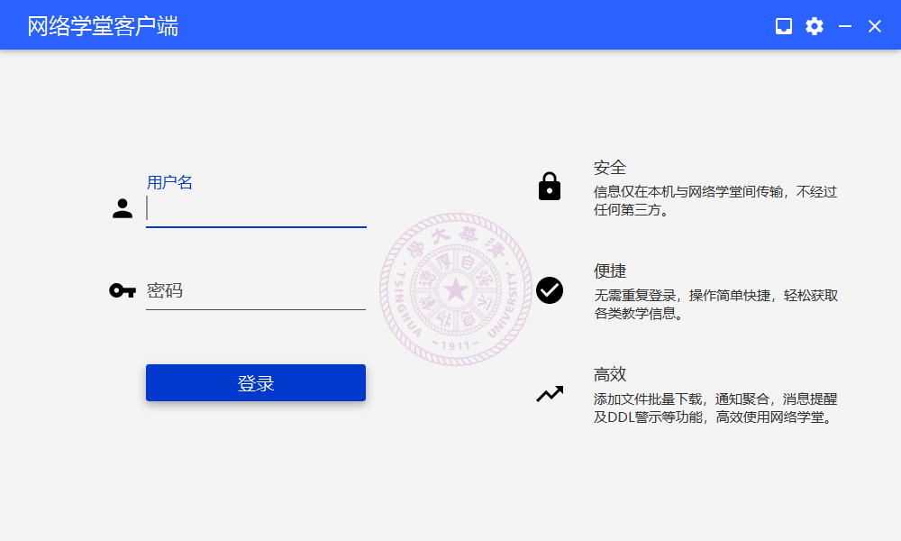
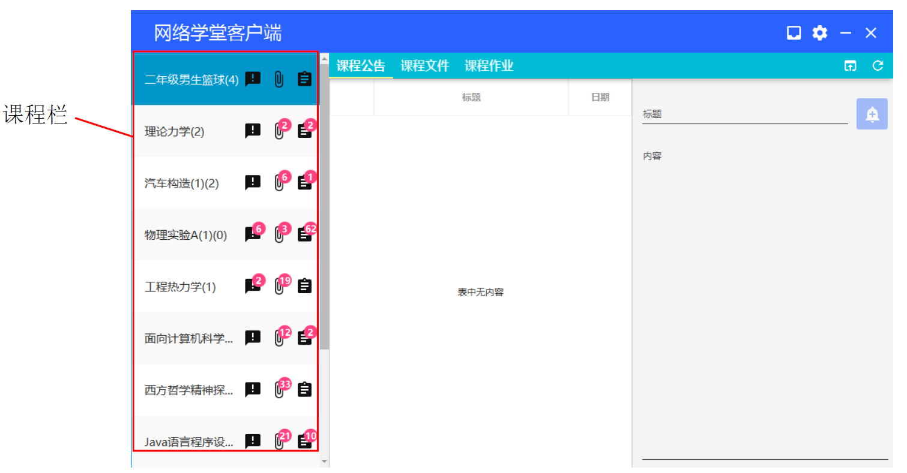
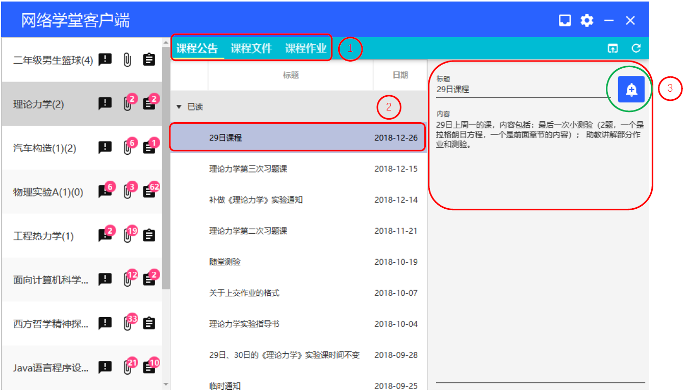
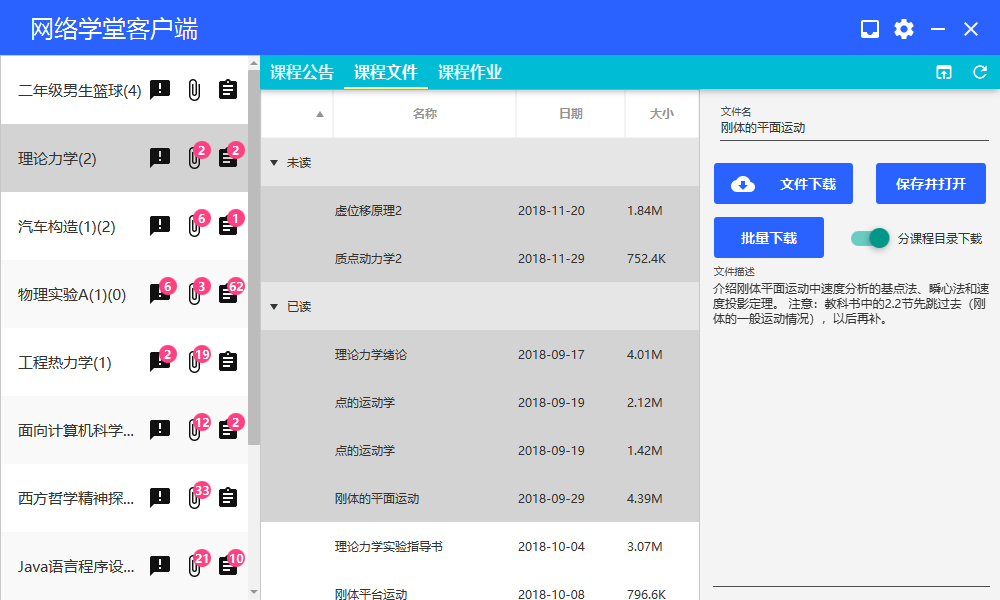
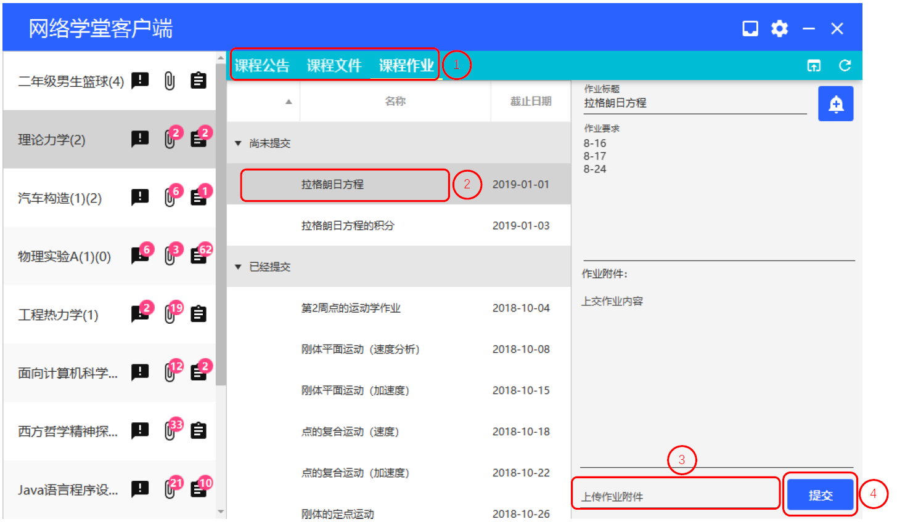
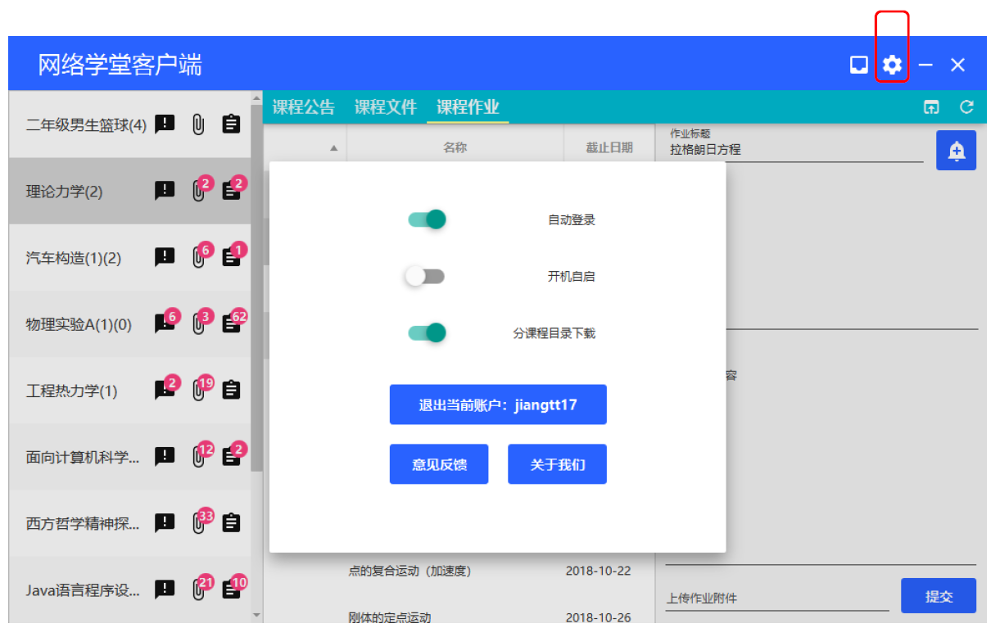
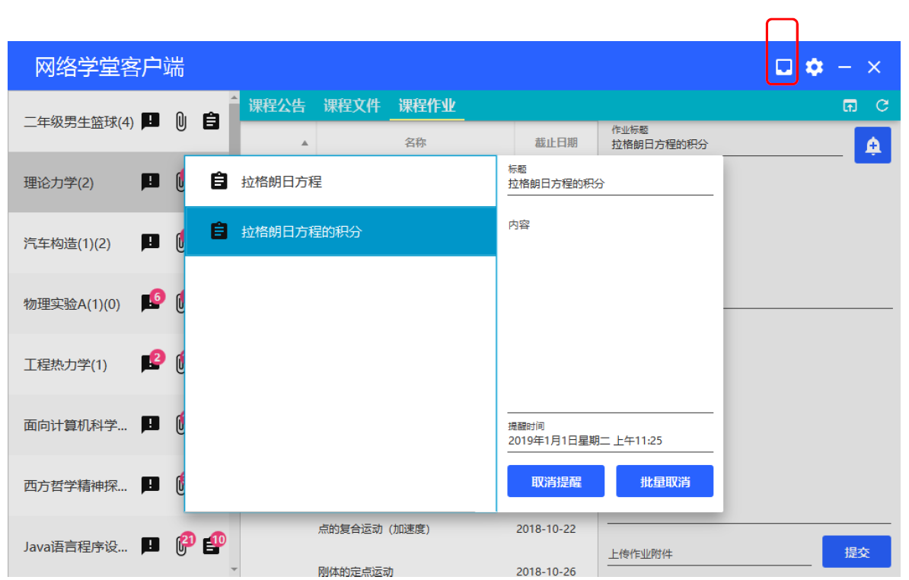
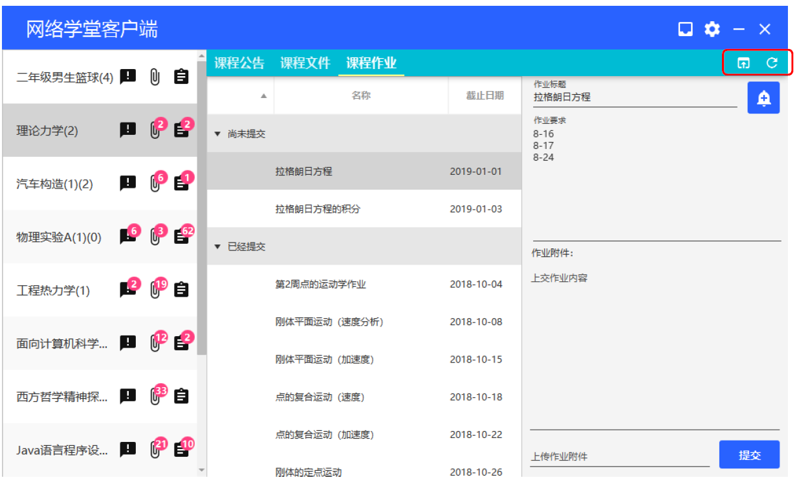

# 网络学堂客户端

## 操作流程

### 登录

打开软件，进入如下图界面，输入用户名、密码，登录账号

### 选择课程

登陆成功后进入下图界面

单击课程栏中的课程名即可选择课程。课程名后的三个图标即右上角的数字分别表示当前未读的课程公告、课程文件和未完成的课程作业数量。

### 查看课程内容

选择课程后，单击“课程公告”、“课程文件”、“课程作业”，然后选择下方条目，即可查看相应内容。 

点击右侧绿色圆圈处的铃铛图标即可将该内容加入系统提醒中，在下图中点击日历和时钟图标，输入提醒日期和时间，到时Windows系统就会发出提醒。（需要关闭Windows关注助手） 

### 下载课程文件 

点击“课程文件”，选择想要下载的课程文件（可用ctrl或shift键多选），如下图

点击右侧“文件下载”按钮可以下载选中的最后一个文件，点击“批量下载”可以下载选中的全部文件，点击“保存并打开”会在执行完“文件下载”功能后打开下载的文件。

“分课程目录下载”的作用是改变默认下载位置，若关闭，则所有课程均按上一次下载的位置为默认位置，若打开，则每一个课程单独记录默认位置。

下载的文件名字均与文件的标题相同。

###提交课程作业 

单击“课程作业”，选择想要提交的作业，单击“上传作业附件”，选择想要提交的作业文件，然后点击“提交”按钮即可，如下图。

作业同样可以通过右上角的铃铛按钮加入提醒中。

## 设置及其他功能

### 设置

单击右上角齿轮按钮可以打开设置面板，其中由于本软件没有要求以管理员权限运行，在打开“开机自启”功能时，需要向startup文件夹写入文件，会被部分杀毒软件认为是可疑操作。

点击设置面板外的区域可以关闭面板。

### 提醒管理

点击右上角手机图标，可以打开提醒管理界面，如下图，可以查看并取消提醒。

点击提醒管理面板外的区域可以关闭面板。

### 其他功能

图中红圈圈出的按钮分别为弹出和刷新按钮，作用分别是在浏览器中查看当前内容和刷新界面。 

